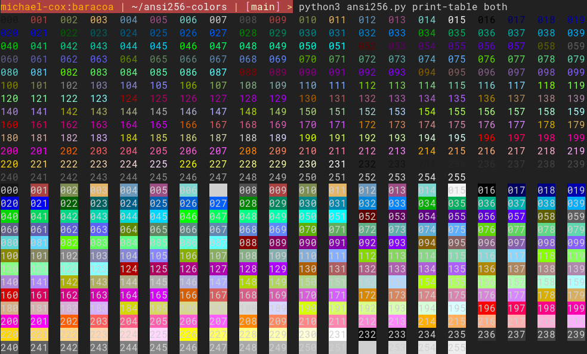
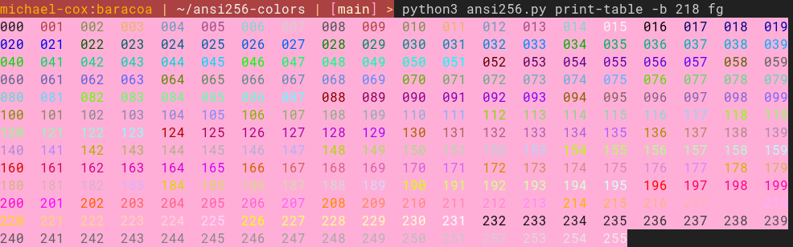
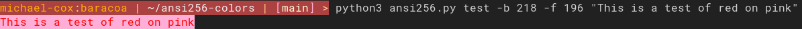

# ansi256-colors

A tool to print and demo ansi color codes for a 256 color terminal.

## Install
Install using pip:
```
pip install ansi256colors
```

## Usage
```
> ansi256 -h
usage: ansi256 [-h] {print-table,test,write} ...

a tool for printing, testing, and exporting ansi color escapes

positional arguments:
  {print-table,test,write}
    print-table         print a table of the ansi color codes
    test                test color codes on a string
    write               write a zsh-rc style file that exports all color codes

options:
  -h, --help            show this help message and exit
```

### Printing Tables
```
> ansi256 print-table --help
usage: ansi256 print-table [-h] [-f [0-255]] [-b [0-255]] {fg,bg,both}

positional arguments:
  {fg,bg,both}          specify whether to print foreground, background, or both color code tables

options:
  -h, --help            show this help message and exit
  -f [0-255], --foreground [0-255]
                        specify a foreground color to be on top of the background table
  -b [0-255], --background [0-255]
                        specify a background color to be the background of the foreground table
```

For example:
```
ansi256 print-table both
```


```
ansi256 print-table -b 218 fg
```


### Printing Tests
```
> ansi256 test -h         
usage: ansi256 test [-h] [-f [0-255]] [-b [0-255]] TEXT

positional arguments:
  TEXT                  text to test

options:
  -h, --help            show this help message and exit
  -f [0-255], --foreground [0-255]
                        specify the foreground color code (0-255)
  -b [0-255], --background [0-255]
                        specify the background color code (0-255)
```

For example:
```
ansi256 test -b 218 -f 196 "This is a test of red on pink"
```


### Writing RC files
```
> ansi256 write -h
usage: ansi256 write [-h] FILE

positional arguments:
  FILE        file to write the exports to

options:
  -h, --help  show this help message and exit
```

```
> ansi256 write testrc
> head -5 testrc
export COLOR0_FG=$'%{\e[38;5;0m%}'
export COLOR0_BG=$'%{\e[48;5;0m%}'
export COLOR1_FG=$'%{\e[38;5;1m%}'
export COLOR1_BG=$'%{\e[48;5;1m%}'
export COLOR2_FG=$'%{\e[38;5;2m%}'
```
